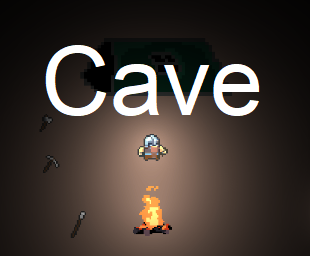

It’s # Cave
Ludum Dare Jam #45 entry. Theme: "Start with nothing"

2D survival RPG with Dark Souls battle system

# Downloads and Links
Available in [Windows, OSX, and Linux](https://teamon.itch.io). If you encounter any problem, please leave a issue! 

# Controls
 * WASD or LMB(Left Mouse Button) for moving​
 * I to open inventory
 * 1-5 choose item in hotbar
 * Mouse over item & click on it to pick up it. Dwarf will be automatically move to it.​
 * Try read How To Play

# Ludum Dare?
Ludum Dare is one of the world's largest and longest running Game Jam events. Is an event where you create a game from scratch in a weekend based on a theme.

[Cave in Ludum Dare #45](https://ldjam.com/events/ludum-dare/45/cave)

# Credits
 * [Team-on](https://github.com/Team-on) - programmer the best programmer ever
 * [Long-as-Python](https://github.com/Long-as-Python) - artist and programmer
 * [sleeplessmaliance](https://github.com/sleeplessmaliance) - artist of hentai
 * [moogy73](https://freesound.org/people/moogy73/sounds/425728) - click sound
